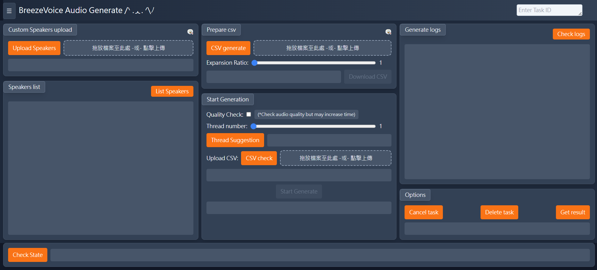

# BreezeVoice Audio Generator 🎵

<div align="center">



_一個現代化的語音生成前端應用程式，基於 Vue 3 + TypeScript 構建_

</div>

## 📖 專案概述

BreezeVoice 是一個功能豐富的語音合成前端介面，提供批量音訊生成和單一音訊生成兩種模式。使用者可以上傳自訂語音模型、管理語音任務，並透過直觀的 Web 介面控制整個語音生成流程。

## ✨ 主要功能

### 🎯 批量語音生成 (Task Generate)

- **📂 自訂語音上傳**: 支援 ZIP 格式的語音模型上傳
- **📋 CSV 文件處理**:
  - TXT 轉 CSV 功能，支援擴展比例調整 (1.0-3.0)
  - CSV 格式驗證和檢查
  - 批量文本處理
- **⚙️ 進階設定**:
  - 音質檢查選項 (可能增加處理時間)
  - 多執行緒處理 (1-3 執行緒)
  - 智慧執行緒數量建議
- **📊 即時監控**:
  - 任務狀態追蹤
  - 生成進度顯示
  - 詳細日誌記錄
- **🎛️ 任務管理**:
  - 取消正在執行的任務
  - 刪除已完成的任務
  - 批量下載生成的音訊檔案 (ZIP 格式)

### 🎤 單一語音生成 (Single Generate)

- **🎭 語音選擇**:
  - 動態語音清單載入
  - 語音試聽功能
  - 即時語音切換
- **✍️ 文本輸入**:
  - 即時文本編輯
- **⚡ 即時生成**:
  - 快速單一音訊生成
  - 即時播放預覽
  - 單檔下載功能

### 🎮 互動式寵物系統

- **🐱 多樣化寵物**: 史萊姆、豬、蘑菇等
- **🎭 豐富動畫**: 移動、站立、跳躍、受擊、死亡動畫
- **🎯 互動機制**:
  - 點擊攻擊系統
  - 血量系統
  - 擊退效果
  - 自動重生機制
- **🤖 AI 行為**: 隨機移動、跳躍、休息決策

### 🛠️ 使用者體驗

- **📱 響應式設計**: 支援桌面端和行動裝置
- **🎨 現代化 UI**: 基於 Tailwind CSS 的深色主題
- **💡 智慧提示**: 懸停顯示操作示例圖片
- **🔄 即時反饋**: 所有操作都有即時狀態更新

## 🏗️ 技術架構

### 前端技術棧

- **框架**: Vue 3 (Composition API)
- **語言**: TypeScript
- **構建工具**: Vite
- **樣式**: Tailwind CSS
- **HTTP 客戶端**: Axios
- **狀態管理**: Vue 3 Provide/Inject 模式

### 後端整合

- **API 伺服器**:
- **支援格式**:
  - 上傳: ZIP (語音模型), TXT (文本), CSV (批量數據)
  - 下載: WAV (音訊), CSV (處理後數據), ZIP (批量音訊)

## 🚀 快速開始

### 環境需求

- Node.js 18+
- npm 或 yarn

### 安裝步驟

1. **克隆專案**

```bash
git clone <repository-url>
cd bv_vue
```

2. **安裝依賴**

```bash
npm install
```

3. **開發模式運行**

```bash
npm run dev
```

4. **構建生產版本**

```bash
npm run build
```

5. **預覽構建結果**

```bash
npm run preview
# 或使用 serve
npx serve dist
```

## 📦 部署指南

### 靜態部署

構建完成後，`dist/` 資料夾包含所有需要的靜態檔案：

```bash
npm run build
# 將 dist/ 資料夾部署到任何靜態檔案伺服器
```

### 支援的部署平台

- **Netlify**: 拖放 `dist` 資料夾
- **Vercel**: 拖放或 Git 整合
- **GitHub Pages**: 上傳 `dist` 內容
- **傳統伺服器**: Apache、Nginx、IIS 等

## 🎯 使用流程

### 批量生成工作流程

1. 輸入任務 ID
2. 上傳自訂語音模型 (ZIP 格式)
3. 上傳或生成 CSV 文件
4. 配置生成參數 (品質檢查、執行緒數)
5. 開始批量生成
6. 監控生成進度
7. 下載完成的音訊檔案

### 單一生成工作流程

1. 輸入任務 ID
2. 選擇目標語音
3. 試聽語音樣本
4. 輸入要生成的文本
5. 點擊生成
6. 預覽和下載結果

## 🔧 開發指令

```bash
# 開發伺服器
npm run dev

# 類型檢查
npm run type-check

# 構建生產版本
npm run build

# 僅構建 (跳過類型檢查)
npm run build-only

# 預覽構建結果
npm run preview

# 代碼檢查
npm run lint

# 代碼格式化
npm run format
```

## 📂 專案結構

```
bv_vue/
├── src/
│   ├── components/
│   │   └── Common/
│   │       └── UploadHandler.vue      # 檔案上傳組件
│   ├── views/
│   │   ├── TaskGenerateView.vue       # 批量生成頁面
│   │   ├── SingleGenerateView.vue     # 單一生成頁面
│   │   └── WalkerCompose.vue          # 互動寵物系統
│   ├── assets/
│   │   ├── samples/                   # 示例圖片
│   │   └── pet/                       # 寵物動畫資源
│   ├── router/                        # 路由配置
│   ├── stores/                        # 狀態管理
│   ├── App.vue                        # 主應用組件
│   └── main.ts                        # 應用入口點
├── dist/                              # 構建輸出 (部署用)
├── public/                            # 靜態資源
└── package.json                       # 專案配置
```

## 🎨 設計特色

- **🌙 深色主題**: 專業的深色界面設計
- **📱 響應式布局**: 適配不同螢幕尺寸
- **🎭 豐富動畫**: 流暢的過渡效果和互動反饋
- **💡 直觀操作**: 清晰的視覺層次和操作流程
- **🎮 趣味元素**: 可愛的寵物系統增加使用樂趣

## 🤝 貢獻指南

歡迎提交 Issue 和 Pull Request 來改進這個專案！

## 📄 授權

此專案採用 MIT 授權條款。
